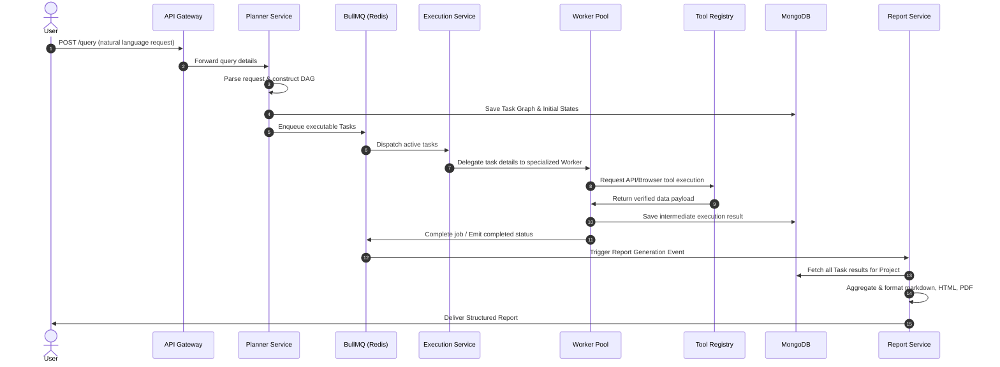

# Omni Agent System Design & Architecture Specification

Omni Agent is a distributed, event-driven multi-agent research platform designed to decompose natural language queries, execute parallel search and reasoning tasks via specialized worker pools, validate findings, and compile structured analytical reports.

---

## 1. High-Level Architecture

The system flows from user ingestion to final report delivery through asynchronous processing boundaries.

### 1.1 ASCII Data Flow Diagram

```text
       +--------------+
       |     User     |
       +-------+------+
               | (1) Submit Query
               v
       +-------+------+
       | API Gateway  |
       +-------+------+
               | (2) Ingest
               v
       +-------+------+
       |   Planner    | <----+ (3) Retrieve Context
       |   Service    |      |
       +-------+------+      v
               | (4) Write  +--------------+
               |     Task   | Vector DB    |
               |     DAG    | (Qdrant)     |
               v            +--------------+
       +-------+------+
       |    Redis     |
       |  (BullMQ)    |
       +-------+------+
               | (5) Poll / Trigger Jobs
               v
       +-------+------+
       |  Execution   |
       |   Service    |
       +-------+------+
               | (6) Spin up
               v
       +-------+------+
       | Worker Pool  |
       +-------+------+
               | (7) Resolve Tool
               v
       +-------+------+
       | Tool Registry|
       +-------+------+
               | (8) Execute Outbound Calls
               v
       +-------+------+
       |  External    | (Tavily, Serper, Playwright, Firecrawl, etc.)
       |  APIs / SDKs |
       +-------+------+
               | (9) Save Result State
               v
       +-------+------+
       |   MongoDB    |
       +-------+------+
               ^
               | (10) Aggregation & Formatting
       +-------+------+
       |    Report    |
       |   Service    |
       +-------+------+
               | (11) Export PDF/MD
               v
       +-------+------+
       | Final Report |
       +--------------+
```

### 1.2 System Sequence Diagram



---

## 2. Team Structure & Component Ownership

| Layer | Service | Key Responsibilities | Domain Boundaries |
| :--- | :--- | :--- | :--- |
| **Layer 1** | **Planning Layer** (`planner-service`) | • Construct task graphs (DAGs)<br>• Manage prompt engineering templates<br>• Query Vector DB (Qdrant) for RAG context<br>• Store planned tasks in MongoDB | Must never write worker execution rules or call execution message queues directly. |
| **Layer 2** | **Execution Layer** (`execution-service`) | • Orchestrate BullMQ queues & Redis channels<br>• Manage worker pool lifecycles (Web, Browser, LLM)<br>• Run parallel executions & enforce timeouts<br>• Handle tool registration and fallbacks | Must never contain planning logic, user prompt templating, or RAG embeddings generation. |
| **Layer 3** | **Citation & Summariser Layer** (`report-service`) | • Aggregate multi-source worker outputs<br>• Extract, verify, & de-duplicate citations<br>• Format outputs to Markdown, HTML, and PDF<br>• Synthesize final analytical report | Must never execute worker tasks or handle queue retries. |

---

## 3. Tech Stack

- **Backend runtime**: Node.js (v20+)
- **Language**: TypeScript (v5.0+) with strict type configurations
- **Web API framework**: Express
- **Queueing Broker**: BullMQ on top of Redis
- **Primary Database**: MongoDB (for document, task state, and log retention)
- **Vector Database**: Qdrant (for semantic knowledge indexing and document RAG)
- **LLM Integrations**: OpenAI (GPT-4o), Anthropic (Claude 3.5 Sonnet), Google (Gemini 1.5 Pro), Llama, DeepSeek
- **Search Engines**: Tavily Search API, Serper Google Search
- **Browser Automation**: Playwright, Browser Use
- **Scraping Engine**: Firecrawl
- **Object Storage**: AWS S3 (for storing generated PDF and HTML reports)
- **Containerization & Hosting**: Docker, Docker Compose, Kubernetes
- **Observability**: Winston (structured logging), OpenTelemetry (tracing), Grafana (monitoring dashboards)

---

## 4. Architectural Principles

1. **Clean Architecture**: Decouple business logic from database frameworks and web delivery systems.
2. **SOLID Design**: Class structures follow Single Responsibility, Open-Closed, Liskov Substitution, Interface Segregation, and Dependency Inversion rules.
3. **Dependency Injection**: Services and repositories are injected dynamically, enabling unit testing using mock frameworks.
4. **Repository Pattern**: All database interactions are mediated via dedicated repositories, separating Mongoose schemas from service domains.
5. **Event-Driven**: Services emit events via Redis Pub/Sub or message queues to trigger downstream services.
6. **Stateless Workers**: Workers do not hold persistent data. Any intermediate state is saved in MongoDB or Redis.
7. **Observability**: Traces, metrics, and structured logs are written for every task execution.

---

## 5. Project Folder Structure

```text
omni-agent/
├── apps/
│   ├── api/                     # Main backend gateway exposing Express REST endpoints
│   ├── planner-service/         # Query analysis, decomposition, and task database writes
│   ├── execution-service/       # Queue consumers, worker lifecycle, and tool executors
│   └── report-service/          # Citation consolidation and document generation
├── packages/
│   ├── shared/                  # Common TypeScript types, validations, constants, and logger
│   ├── database/                # Shared Mongoose models, repositories, and Redis clients
│   ├── sdk/                     # Wrapped external tools (Tavily, OpenAI, Playwright, etc.)
│   └── events/                  # Definitions for cross-service event messaging
├── infrastructure/
│   ├── docker/                  # Dockerfiles for each microservice
│   ├── kubernetes/              # Helm charts and manifests
│   └── monitoring/              # Grafana dashboards and Prometheus setups
```

---

## 6. Workers & Tool Registry

Workers never communicate with third-party SDKs directly. Instead, they access dependencies using the **Tool Registry**.

### 6.1 Tool Registry Invocation Pattern

```typescript
export interface IToolResponse<T = any> {
  success: boolean;
  data: T;
  error?: string;
}

export interface ITool {
  name: string;
  execute(args: any): Promise<IToolResponse>;
}

// Registry encapsulates all SDK interactions
export class ToolRegistry {
  private tools: Map<string, ITool> = new Map();

  registerTool(name: string, tool: ITool): void {
    this.tools.set(name, tool);
  }

  async executeTool(name: string, args: any): Promise<IToolResponse> {
    const tool = this.tools.get(name);
    if (!tool) {
      return { success: false, data: null, error: `Tool ${name} not found.` };
    }
    try {
      return await tool.execute(args);
    } catch (err: any) {
      return { success: false, data: null, error: err.message };
    }
  }
}
```

### 6.2 Supported Workers

1. **Web Worker**: Crawls webpages via Firecrawl or Axios.
2. **GitHub Worker**: Commits, PRs, and reads files from repositories.
3. **Browser Worker**: Puppeteer/Playwright scripts executing browser action streams.
4. **Document Worker**: Parses docx, pdf, or csv file uploads.
5. **Code Worker**: Evaluates math/data operations in isolated JS runner contexts.
6. **API Worker**: Hits generic REST endpoints.
7. **LLM Worker**: Directs complex text processing tasks to configured LLMs.
8. **RAG Worker**: Handles embedding searches in Qdrant database.

---

## 7. Queue Flow & Lifecycle

All queue jobs undergo strict status transitions inside BullMQ.

### 7.1 Queue Flow Diagram

```text
[Planner Service] --Enqueue Job--> [ Redis Queue ]
                                         │
                                   (BullMQ Polls)
                                         │
                                         v
                              [ Execution Service ]
                                         │
                                  (Acquire Lock)
                                         │
                                         v
                                [ Specialized Worker ]
                                         │
                                  (Execute Tool)
                                         │
                                         v
                                [ Save Output to DB ]
                                         │
                                         v
                                 (Release Lock)
                                         │
                                         v
[Report Generator] <---Emit Event-- [ Complete Job ]
```

### 7.2 Job Lifecycle States

- **Waiting**: Task is placed in the queue waiting for worker availability.
- **Active**: Worker has acquired the task lock and is executing.
- **Completed**: Task completed successfully, writing results to MongoDB.
- **Failed**: Task encountered an exception, routing to retry scheduler or Dead Letter Queue (DLQ).

---

## 8. Database Schema Design

### 8.1 Tasks Schema

```json
{
  "taskId": { "type": "String", "unique": true, "index": true },
  "projectId": { "type": "String", "index": true },
  "type": { "type": "String", "enum": ["WEB", "BROWSER", "GITHUB", "LLM", "RAG"] },
  "status": { "type": "String", "enum": ["pending", "running", "completed", "failed"] },
  "dependencies": [{ "type": "String" }],
  "input": { "type": "Mixed" },
  "output": { "type": "Mixed" },
  "retriesRemaining": { "type": "Number", "default": 3 },
  "createdAt": { "type": "Date" }
}
```

### 8.2 Collections List

- **Projects**: Aggregates tasks for a single request query context.
- **Tasks**: Specific processing items.
- **Results**: Extracted markdown blocks and metadata from completed workers.
- **Reports**: Markdown, HTML, and PDF compiled artifacts.
- **ExecutionLogs**: Log statements tracking execution tracing metrics.
- **Workers**: Health statuses of active execution processes.
- **Users**: Authentication rules and account identifiers.

---

## 9. Error Handling & Resilience

- **Exponential Backoff**: Failed worker tasks automatically retry with backoff multipliers.
- **Dead Letter Queue (DLQ)**: Tasks failing more than 3 times are logged to DLQ to prevent blocking the queues.
- **Circuit Breakers**: Wraps external tools (e.g., Tavily, OpenAI) to quickly fail-fast when APIs are down, routing traffic to fallback models.

---

## 10. Performance, Scaling, & Security

### 10.1 Scaling Strategy

- **Stateless Services**: Scale Express and Worker instances horizontally using Kubernetes Pod Horizontal Autoscaling (HPA) based on CPU and memory usage.
- **Redis Cluster**: Shard Redis instances to distribute BullMQ state memory across multiple nodes.

### 10.2 Security Best Practices

- **API Token Encryption**: External SDK credentials are encrypted at rest using AES-256 before storage in MongoDB.
- **Sandboxed Execution**: Code Workers running untrusted scripts use locked-down Docker sandboxes to block filesystem or internal network access.

---

## 11. FAQ & Troubleshooting

### Q1: How do I handle a task stuck in "active" state?
*Check if the worker process was terminated abruptly. BullMQ will automatically release the lock after the configured timeout (`lockDuration`), putting the task back to waiting or failed.*

### Q2: What happens if a tool API key expires?
*The tool wrapper will trigger a circuit breaker event, alerting the monitoring system, and routing execution requests to fallback models (e.g., falling back to Gemini if Claude fails).*
